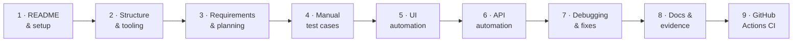
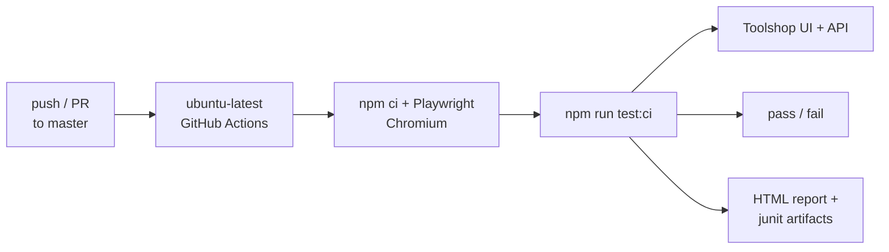
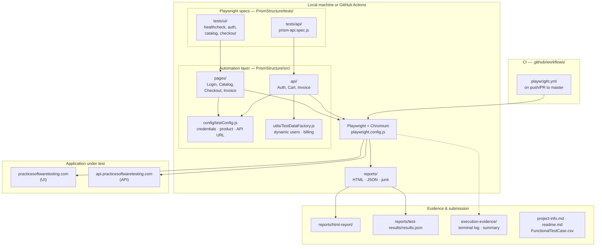

# QA AI Practical Assessment

[](https://github.com/sdet-deepti/qa-ai-practical-assessment/actions/workflows/playwright.yml)

Playwright automation for [PracticeSoftwareTesting Toolshop](https://practicesoftwaretesting.com/).

---

## Project overview

Work was delivered in **nine phases**, each merged to `master` via a pull request (readme → structure → planning → manual tests → UI → API → debugging → docs → CI).

### Phase delivery (high level)



| Phase | Deliverable | Key paths |
|-------|-------------|-----------|
| 1 | Run guide | `readme.md` |
| 2 | Tooling & layout | `.cursor/rules/`, `.gitignore`, `execution-evidence/` |
| 3 | Requirements | `ai-prompts/requirements-and-planning.md` |
| 4 | Manual tests | `FunctionalTestCase.csv`, `ai-prompts/test-design.md` |
| 5 | UI suite | `PrismStructure/src/pages/`, `tests/ui/` |
| 6 | API suite | `PrismStructure/src/api/`, `tests/api/`, `testConfig.js` |
| 7 | Stabilization | `ai-prompts/automation-and-debugging.md` |
| 8 | Submission docs | `project-info.md`, `execution-evidence/` |
| 9 | CI pipeline | `.github/workflows/playwright.yml` |

---

## Setup

```bash
cd PrismStructure
npm install
npx playwright install chromium
```

All commands below run from **`PrismStructure/`** (where `playwright.config.js` lives).

---

## Run Tests (from `PrismStructure/`)

> **Important:** Always `cd PrismStructure` first. Running from the repo root writes reports to the wrong `reports/` folder and finds no tests.


```bash
npx playwright test --project=chromium
```

### By folder

```bash
npx playwright test tests/ui --project=chromium
npx playwright test tests/api --project=chromium
```

### By tag

```bash
npx playwright test --grep @smoke --project=chromium
npx playwright test --grep @regression --project=chromium
```

### One spec at a time

```bash
npx playwright test tests/ui/healthcheck.spec.js --project=chromium
npx playwright test tests/ui/prism-auth.spec.js --project=chromium
npx playwright test tests/ui/prism-catalog.spec.js --project=chromium
npx playwright test tests/ui/prism-checkout.spec.js --project=chromium
npx playwright test tests/api/prism-api.spec.js --project=chromium
```

### Reports & evidence

```bash
npx playwright show-report reports/html-report
npm run test:evidence    # full run + saves execution-evidence/terminal-execution.log
```

### Optional npm shortcuts

```bash
npm test
npm run test:ui:smoke
npm run test:ui:regression
npm run test:api:smoke
```

---

## CI (GitHub Actions)

Pushes and pull requests to `master` run the full Playwright suite on Ubuntu (public runners).

- Workflow: `.github/workflows/playwright.yml`
- Command: `npm run test:ci` from `PrismStructure/`
- Artifacts: HTML report, junit XML, and failure traces (Actions tab → run → Artifacts)

### Local vs CI

| Topic | Local | CI (`ubuntu-latest`) |
|-------|--------|-------------------------|
| SUT | Home network → Toolshop | GitHub datacenter IP → same live site |
| Workers | `2` (parallel) | `1` (sequential) |
| Retries | `0` | `1` on failure |
| Registration smoke | Runs (live register + login) | **Skipped** — flaky on shared runners |
| Login wait | API `POST /users/login` 200 + catalog search visible | Same (stable for checkout/catalog) |

CI failures were traced to **login timing** (click returned before session established) and **waiting on `nav-menu`** instead of catalog-ready signals. See `ai-prompts/automation-and-debugging.md` entries 12–14.



---

## Configuration & Test Data

Full **environment and data lifecycle matrix:** [`docs/environment-and-data-strategy.md`](docs/environment-and-data-strategy.md)

### Where data comes from

| Data type | Source | Used for |
|-----------|--------|----------|
| **Login credentials** (fixed user) | `config/testConfig.js` → `credentials` | Checkout, catalog, API login specs |
| **Product id, quantity, search keyword** | `config/testConfig.js` → `product` | UI catalog/checkout + API payloads |
| **API base URL** | `config/testConfig.js` → `api.baseUrl` | AuthApi, CartApi, InvoiceApi |
| **Registration user** (dynamic) | `src/utils/TestDataFactory.js` | `prism-auth.spec.js` register+login test only |
| **Invoice billing payload** | `TestDataFactory.generateInvoiceBillingDetails()` | API invoice tests |
| **Negative login** | Hardcoded invalid user in `prism-auth.spec.js` | Regression only |

### `config/testConfig.js`

```javascript
credentials: { email, password }     // default Toolshop customer
product: { id, searchKeyword, quantity, cartQuantity }
api: { baseUrl }
```

### Environment overrides

```bash
PLAYWRIGHT_USER_EMAIL=customer@practicesoftwaretesting.com
PLAYWRIGHT_USER_PASSWORD=welcome01
PLAYWRIGHT_PRODUCT_ID=01KZFVWJVB996WQ7182R8P1C8R
PLAYWRIGHT_PRODUCT_QUANTITY=2
PLAYWRIGHT_SEARCH_KEYWORD=Pliers
PLAYWRIGHT_CART_QUANTITY=2
npx playwright test --project=chromium
```

---

## Architecture (full flow)

End-to-end view: specs, automation layer, external application, reports, evidence, and CI.



**UI flow:** Spec → Page Object → `testConfig` (login/product) → Toolshop UI  
**API flow:** Spec → API controller → `testConfig` + `TestDataFactory` → Toolshop API  
**Checkout login step:** `CheckoutPage.proceedThroughSteps()` falls back to `testConfig.credentials` when no login data is passed.

---

## Reports & Evidence (submission locations)

Per the assessment deliverable, execution reports live **inside `PrismStructure/`** — not at the repo root.

| Artifact | Publish / submit from |
|----------|---------------------|
| HTML report | `PrismStructure/reports/html-report/` |
| JSON results | `PrismStructure/reports/test-results/results.json` |
| Terminal log | `execution-evidence/terminal-execution.log` |
| Run summary | `execution-evidence/execution-summary.md` |

```bash
cd PrismStructure
npx playwright test --project=chromium
npx playwright show-report reports/html-report
```

There is **no** `reports/` folder at the repo root by design. Always run tests from `PrismStructure/`.

---

## Folder Structure

```text
PrismStructure/
├── config/testConfig.js       # credentials, product, API URL
├── playwright.config.js
├── src/
│   ├── pages/                 # UI Page Objects
│   ├── api/                   # API controllers
│   └── utils/TestDataFactory.js
├── tests/ui/                  # UI specs (@smoke / @regression)
├── tests/api/                 # API specs (@smoke / @regression)
└── reports/                   # HTML + JSON execution reports (generated)
```
