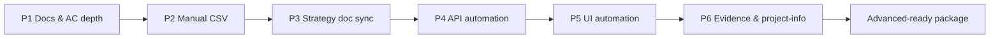

# Review Improvement Plan — QA AI Practical Assessment

**Review signal:** 88/100 · **Indicative standing:** Solid across the lifecycle (75–89)  
**Plan author:** Deepti Yadav  
**Plan date:** August 9, 2026  
**Repo:** https://github.com/sdet-deepti/qa-ai-practical-assessment  
**Default branch:** `master`

---

## 1. Purpose

This document is the **execution plan** to close gaps from the lifecycle review and move from **Solid** toward **Advanced** standing. Work is **phased**: each phase ends with a **local green Playwright run** before opening a merge request (MR/PR).

**Do not start coding from this file alone** — implement one phase at a time, verify locally, then publish.

---

## 2. End goal (definition of done)

When this plan is complete, the repo should demonstrate:

| Area | Target state |
|------|----------------|
| **Requirements** | AC1/AC2 plus **profile**, **logout**, and **invoice number format** documented with risks and traceability |
| **AI workflow** | **3+ explicit AI-output rejection** entries with reasoning (not only iteration chains) |
| **Test strategy** | **Environment + data lifecycle matrix** (local, CI, env vars, faker vs fixed creds) |
| **Manual design** | **16+ cases** including boundaries (password rules, quantity edges, invoice format) |
| **Automation** | **Deeper assertions**: cart totals/line items, invoice id/format + line content, **logout** (UI + token invalidation where API allows) |
| **API depth** | Add-to-cart **probed and documented**; if endpoint unavailable, **cart GET assertions** prove item/total depth after UI or alternate API path |
| **Evidence** | Execution summary dates aligned with assessment window; **HTML report screenshot** in `execution-evidence/` |
| **CI** | GitHub Actions green on `master` (registration smoke may remain CI-skipped if flaky) |

**Local gate (every phase):**

```bash
cd PrismStructure && npm install && npx playwright install chromium
npx playwright test --project=chromium
# Expect: 0 failed; document skip count in execution-summary.md
```

---

## 3. Review gap → fix mapping

| Review gap | Root cause in repo today | Planned fix | Phase |
|------------|-------------------------|-------------|-------|
| Profile verification not analyzed | AC1 mentions profile; no profile-page AC in requirements doc | Extend AC1 + risk rows; manual + UI spec | P2, P4 |
| Logout not analyzed / untested | No logout in CSV, specs, or API | AC + manual cases + UI logout + API token reuse test | P2, P4, P5 |
| Invoice number format not analyzed | `verifyLatestInvoice()` only waits for table visibility | Document format rule; assert pattern on UI + API `invoice.id` | P2, P4, P5 |
| Few AI rejection examples | Prompt logs show iteration, not “rejected wrong output” | New prompt entries with **Rejected / Reason / Replacement** | P1 |
| Env/data strategy thin | Env vars listed in project-info only | `docs/environment-and-data-strategy.md` | P1 |
| Manual: password boundaries | CSV has invalid password only, not complexity edges | TC_UI_010–012 boundary cases | P3 |
| Manual: profile, logout, invoice format | Missing rows | TC_UI_007–009, TC_API_007–008 | P3 |
| API add-to-cart skipped | `POST /carts/{id}/items` → 404 historically | Re-probe OpenAPI; implement or document + deepen `getCart` | P5 |
| Shallow invoice assertions | Status badge visible only | Assert invoice id format, payment method, amount/line | P5 |
| Cart totals shallow | Catalog test doesn’t assert price × qty | Assert cart badge / cart page totals | P5 |
| Logout token invalidation | No `AuthApi.logout` | `GET /users/me` or protected route with stale token → 401 | P5 |
| Execution date inconsistency | Summary says Aug 2026; reviewer flagged template artifact | Clarify assessment window + “last verified run” date | P6 |
| No HTML report screenshot | Evidence is log + markdown only | Capture `reports/html-report/index.html` screenshot | P6 |

---

## 4. Execution principles

1. **One concern per PR** — docs-only, manual-only, API-only, UI-only, evidence-only (matches existing phased git workflow).
2. **Local green before push** — no MR until `npx playwright test --project=chromium` passes locally.
3. **Ponytail / minimal diff** — extend existing POMs and APIs; no new frameworks.
4. **Honest SUT limits** — if add-to-cart API still 404, document in requirements + API spec comment; compensate with GET cart structure assertions after UI add or documented workaround.
5. **Conventional Commits PR titles** — `docs:`, `test:`, `feat(ui):`, `feat(api):`, `chore(evidence):`.
6. **WSL for git/gh** — commit via `git commit -F .commit-msg.txt` (PowerShell-safe).

---

## 5. Phase roadmap (MR sequence)



| Phase | Branch | PR title (draft) | Local test gate |
|-------|--------|------------------|-----------------|
| **P1** | `phase-10-req-ac-depth` | `docs: extend AC for profile, logout, invoice format` | No test change — smoke optional |
| **P2** | `phase-11-manual-cases` | `test: add manual cases for profile, logout, boundaries` | No automation change |
| **P3** | `phase-12-env-data-strategy` | `docs: add environment and data lifecycle matrix` | No automation change |
| **P4** | `phase-13-api-depth` | `feat(api): cart depth, logout token, invoice assertions` | API specs pass |
| **P5** | `phase-14-ui-depth` | `feat(ui): profile, logout, invoice and cart assertions` | Full suite pass |
| **P6** | `phase-15-evidence-sync` | `chore(evidence): screenshot, dates, project-info sync` | Full suite + evidence refresh |

**After P6:** Re-run CI on `master`; update execution summary with local + CI counts.

---

## 6. Phase details

### P1 — Requirements & responsible AI (docs only)

**Goal:** Close planning score gaps without touching automation.

**Files to create/update:**

| File | Changes |
|------|---------|
| `ai-prompts/requirements-and-planning.md` | Add **Entry 3**: profile page AC, logout flow, invoice id format (`INV-` / numeric per SUT); extend risk matrix |
| `ai-prompts/responsible-ai-rejections.md` | **New** — 3+ rejection stories (XPath in specs, `expect` in POM, single-click invoice, wrong billing country, generic CSV cases) |
| `project-info.md` | Requirements section: profile/logout/invoice format bullets + traceability rows |
| `ai-prompts/documentation-and-summary.md` | Entry linking rejection log |

**Rejection entry template (use 3×):**

```markdown
## Rejection N — [topic]
- **AI output:** What was generated
- **Why rejected:** Specific flaw (brittle locator, wrong AC, security, etc.)
- **Replacement:** What shipped instead + file path
```

**Verify:** Markdown only — optional `cd PrismStructure && npx playwright test --project=chromium` (should still pass).

**MR checklist:**

- [ ] Profile, logout, invoice format in requirements doc
- [ ] 3+ rejection entries with reasoning
- [ ] `project-info.md` traceability updated

---

### P2 — Manual test design expansion

**Goal:** Manual suite covers review gaps; CSV traceable to new AC rows.

**Files:**

| File | Changes |
|------|---------|
| `FunctionalTestCase.csv` | Add rows (see table below) |
| `ai-prompts/test-design.md` | Entry 5 — manual expansion + mapping to automation |

**New manual cases (minimum):**

| ID | Feature | Scenario | Type | Tags |
|----|---------|----------|------|------|
| TC_UI_007 | Profile | Verify profile page shows registered name and email | Positive | @Smoke |
| TC_UI_008 | Logout | Logout returns to login; session cleared | Positive | @Regression |
| TC_UI_009 | Invoice | Latest invoice number matches expected format | Positive | @Regression |
| TC_UI_010 | Registration | Password below minimum length rejected | Negative | @Regression |
| TC_UI_011 | Registration | Password without required complexity rejected | Negative | @Regression |
| TC_UI_012 | Catalog | Quantity boundary (0, max stock) behavior | Negative | @Regression |
| TC_API_007 | Auth | Reuse token after logout returns 401 on protected route | Negative | @Regression |
| TC_API_008 | Cart | GET cart reflects product_id, quantity, and total after add | Positive | @Smoke |

**Verify:** CSV opens cleanly; row count ≥ 20; tags consistent.

**MR checklist:**

- [ ] 8 new rows added
- [ ] Each row maps to AC1/AC2 extension or new AC3-style logout/profile rows in project-info

---

### P3 — Environment & data strategy

**Goal:** Formalize plan-level env/data (test design strategy gap).

**Files:**

| File | Changes |
|------|---------|
| `docs/environment-and-data-strategy.md` | **New** — matrix below |
| `ai-prompts/test-data.md` | Cross-link + entry for matrix |
| `readme.md` | Link to env/data doc |

**Matrix content (minimum):**

| Dimension | Local | CI (GitHub Actions) | Notes |
|-----------|-------|---------------------|-------|
| Base URL UI | practicesoftwaretesting.com | Same | Live SUT |
| Base URL API | api.practicesoftwaretesting.com | Same | Bearer auth |
| Credentials | `testConfig` + env overrides | Same | No secrets in repo |
| Registration data | Faker `@practice-qa.com` | Skipped on CI | `test.skip(CI)` |
| Product id/qty | `testConfig.product` | Env vars optional | In-stock keyword fallback |
| Cart lifecycle | Create per test | Same | Avoid shared state |
| Reports | `PrismStructure/reports/` | Artifact on failure | |
| Data cleanup | New user per register test; fixed user for checkout | Fixed user only | |

**Verify:** Docs only.

---

### P4 — API automation depth

**Goal:** Cart, invoice, and logout token coverage.

**Implementation tasks:**

1. **Probe add-to-cart** — `CartApi.addItem(token, cartId, productId, quantity)`:
   - Try paths from OpenAPI: `POST /carts/{id}/items`, variants if documented.
   - If **404**: keep manual TC_API_004 intent; add API test **“GET cart structure after create”** with assertions on `cart_items` array shape when populated (if SUT pre-seeds or alternate endpoint found, use it).

2. **Cart totals** — After create/get:
   - `expect(details.cart_items.length).toBeGreaterThan(0)` when items exist
   - Assert `quantity`, `product_id`, `price` / `total` fields if present in JSON

3. **Invoice depth** — In E2E API test:
   - `expect(invoice.id).toMatch(/.../)` — pattern from SUT (document in requirements)
   - `expect(invoice.payment_method).toBe('cash-on-delivery')`
   - Assert `invoice_number` or `billing_*` fields if returned

4. **Logout / token invalidation** — `AuthApi`:
   - `logout(token)` if `POST /users/logout` exists; else document UI-only logout
   - Test: login → call protected endpoint (`GET /users/me` or `GET /carts`) → logout or discard token → repeat call → **401**

**Files:**

| File | Changes |
|------|---------|
| `PrismStructure/src/api/CartApi.js` | `addItem`, `addItemWithResponse` (if endpoint works) |
| `PrismStructure/src/api/AuthApi.js` | `logout`, `getCurrentUser` or protected probe |
| `PrismStructure/tests/api/prism-api.spec.js` | New/regression tests |
| `ai-prompts/automation-and-debugging.md` | Entries for API depth work |

**Verify:**

```bash
cd PrismStructure && npx playwright test tests/api --project=chromium
npx playwright test --project=chromium
```

**MR checklist:**

- [ ] Cart assertions beyond `id` match
- [ ] Invoice id/format + payment method asserted
- [ ] Token invalidation test (or documented API limitation with UI coverage in P5)
- [ ] Add-to-cart probed; outcome documented in requirements

---

### P5 — UI automation depth

**Goal:** Profile, logout, invoice content, cart totals on UI.

**Implementation tasks:**

1. **ProfilePage** (new or extend `LoginPage`):
   - Navigate to profile / account
   - Assert `first_name`, `email` match `testConfig` or registered user

2. **Logout**:
   - Open nav menu → Logout
   - Assert URL login/auth and login form visible
   - Optional: API call with cleared session fails (if UI stores token in cookie — probe via context)

3. **Invoice depth** — `InvoicePage`:
   - Locator for invoice number: `[data-test="invoice-number"]` or first row cell
   - `expect(invoiceNumber).toMatch(/INV-?\d+/i)` (adjust to live SUT)
   - Assert status text (Paid/Pending) and amount if column exists

4. **Cart totals** — `prism-catalog.spec.js` or `CartPage`:
   - After `setQuantityAndAddToCart`, assert cart badge count or cart page line total

5. **Registration boundaries** (optional UI spec):
   - Short password → validation message (may run only local, not CI)

**Files:**

| File | Changes |
|------|---------|
| `PrismStructure/src/pages/ProfilePage.js` | New (minimal) |
| `PrismStructure/src/pages/LoginPage.js` or nav helper | `logout()` |
| `PrismStructure/src/pages/InvoicePage.js` | `getLatestInvoiceNumber()`, amount assertions |
| `PrismStructure/tests/ui/prism-auth.spec.js` | Profile + logout tests |
| `PrismStructure/tests/ui/prism-checkout.spec.js` | Deeper invoice assertions |
| `PrismStructure/tests/ui/prism-catalog.spec.js` | Cart total/badge assertions |

**Verify:**

```bash
cd PrismStructure && npx playwright test --project=chromium
# Target: 0 failed; document new test count in execution-summary
```

**MR checklist:**

- [ ] Profile verification spec
- [ ] Logout spec
- [ ] Invoice number format assertion
- [ ] Cart quantity/total assertion
- [ ] All local tests green

---

### P6 — Evidence, dates, submission sync

**Goal:** Documentation & ownership score + reviewer notes.

**Files:**

| File | Changes |
|------|---------|
| `execution-evidence/execution-summary.md` | Add **Assessment window: Aug 5–9, 2026**; **Last local run:** date; test count table updated |
| `execution-evidence/html-report-passing.png` | **New** — screenshot of HTML report (12+ passed) |
| `project-info.md` | Coverage tables, new manual IDs, automation counts, evidence paths |
| `readme.md` | Updated test counts; link env/data doc |
| `ai-prompts/documentation-and-summary.md` | Entry for evidence refresh |

**Capture screenshot:**

```bash
cd PrismStructure
npx playwright test --project=chromium
npx playwright show-report reports/html-report
# Screenshot full report → execution-evidence/html-report-passing.png
```

**Verify:** Full suite + evidence files present.

**MR checklist:**

- [ ] Screenshot in `execution-evidence/`
- [ ] Dates clarified (assessment window vs last run)
- [ ] project-info reflects new coverage
- [ ] CI green after merge

---

## 7. Expected test count (after P5)

| Suite | Before | After (target) |
|-------|--------|----------------|
| API | 6 | 8–10 |
| UI | 6 | 9–12 |
| **Total** | 12 | **17–22** (CI may skip 1–2 flaky) |

Exact count depends on add-to-cart API availability and registration boundary tests.

---

## 8. Risk register (plan-level)

| Risk | Mitigation |
|------|------------|
| `POST /carts/{id}/items` still 404 | Document; strengthen GET cart + UI add path; manual TC_API_004 stays intent |
| No API logout endpoint | UI logout + token cleared from storage; API test uses expired/invalid token pattern |
| Invoice format differs UI vs API | Capture one live sample during P4; document pattern in requirements |
| CI registration flake | Keep `test.skip(CI)` on dynamic register; profile test uses fixed `testConfig` user |
| Live SUT latency | Retain CI `workers: 1`, retries; login wait patterns from existing fixes |

---

## 9. PR workflow (repeat per phase)

```bash
git checkout master && git pull
git checkout -b phase-N-short-name
# ... implement phase only ...
cd PrismStructure && npx playwright test --project=chromium
git add <phase files>
git commit -F .commit-msg.txt
git push -u origin HEAD
gh pr create --base master --title "feat(scope): ..." --body-file .pr-bodies/prN.txt
# After review + CI green:
gh pr merge --merge --delete-branch
```

---

## 10. Success criteria checklist (final)

- [ ] Review gaps in Section 3 all have a shipped artifact
- [ ] `FunctionalTestCase.csv` ≥ 20 rows with boundaries
- [ ] `docs/environment-and-data-strategy.md` exists
- [ ] `ai-prompts/responsible-ai-rejections.md` has ≥ 3 rejections
- [ ] API: cart + invoice + token tests deeper than id-only
- [ ] UI: profile, logout, invoice format, cart totals
- [ ] `execution-evidence/html-report-passing.png` committed
- [ ] Local: `npx playwright test --project=chromium` → 0 failed
- [ ] CI on `master`: green (document skips)
- [ ] Ready for **Advanced** conversation on assertion depth

---

## 11. What to do next (your review)

1. Read phases P1–P6 — adjust scope if any item is out of time budget.
2. Confirm invoice number pattern on live SUT (one manual checkout) before P5 assertions.
3. Reply **“start P1”** (or specify phase) to begin implementation + first MR.

---

*This plan is internal working doc. Add to `.gitignore` if you prefer not to publish, or commit on `phase-10` branch as part of P1.*
